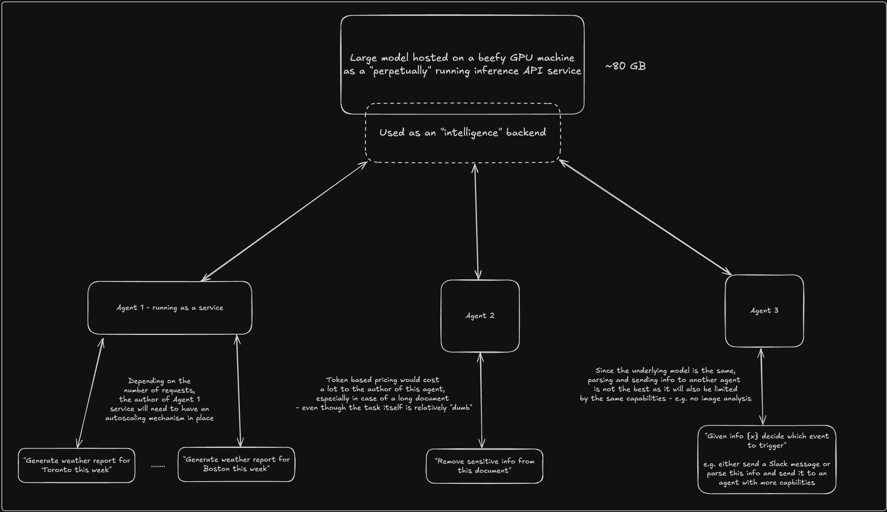
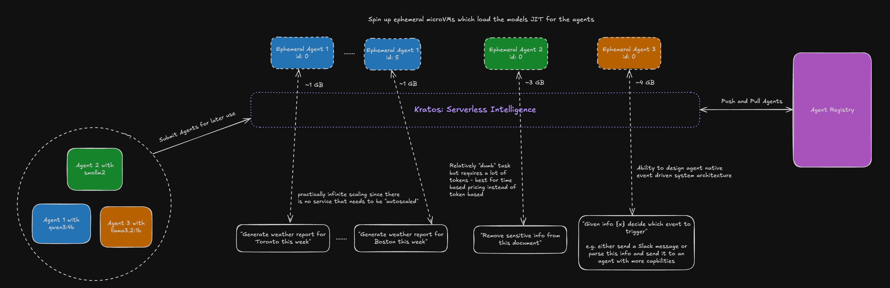

# Kratos  
### Serverless Intelligence

Platform for running ephemeral AI agents in isolated microVMs.

What if intelligence didn't need to run on expensive servers 24/7?

*For agent authors looking to build the next generation of intelligent systems*

---

## Crash Course: Services, Serverless, Virtualization

Service: Assume a chef living in your house always waiting/asking for next demand - you pay him monthly irrespective of how many meals you've had

Serverless: Lives close to your house but you have to call him if you want something made - and he charges you on a per meal basis

Virtualization - handling multiple chefs:
Virtual Machine (VM): Separate floors for cooking
microVM: Separate kitchens
Docker: Same kitchen separate sets of knives and dishes

---

## The Problem with Always-On AI

Picture this: You have successfully hosted an 80GB LLM on a beefy GPU server and are ready to do inference.

Which even on idle will still be burning a whole in your wallet.

---

---

### What's wrong with this picture?

- You're paying for that GPU even at 3 AM when it's doing nothing
- Need to figure out autoscaling (spoiler: it's complicated)
- Every agent has to use the same model, whether it fits or not
- Those $0.01/token charges add up fast for simple tasks

---

## Enter Kratos

Now: What if agents - and their intelligence - only existed when actually needed?

- Spin up isolated microVMs on demand
- Load exactly the model you need for the task
- Run the agent, get the result, clean up completely
- Each agent gets its own targeted sandbox with the right model for the job

---

---

## Why This Actually Makes Sense

- **Zero idle costs** — your wallet (and the planet) will thank you
- **Pick your model** — use Qwen3 for complex reasoning, smaller models for simpler tasks
- **Better economics** — when being charged for compute time, you get monetarily incentivized to use the best model for your particular task
- **Clean slate every time** — no leftover states messing things up
- **Truly isolated** — one agent can't hog resources from another
- **Scale without thinking** — need 100 agents? Sure, why not - modular scaling prevents lengthy deployment times

---

## How It Works

Think of it like serverless functions:

1. Someone writes an agent and packages it with their chosen model
2. They submit it to the registry
3. When you need it, Kratos spins up a fresh microVM, runs your agent, returns results
4. VM gets destroyed completely

One thought at a time, isolated and targeted.

---

## Docker vs MicroVMs: Why It Matters

**Docker containers** share the host OS kernel — fast startup, but less isolation.

**MicroVMs** run their own kernel in milliseconds — true isolation with container-like speed.

For AI agents handling potentially untrusted data, you want that bulletproof isolation with targeted model selection.

**The ecosystem is rapidly evolving:** Apple's working on their own container tech, and companies like E2B are already building their entire platform on microVMs instead of Docker. This isn't just theory—it's happening now.

---

## Real Talk: The Economics

Let's say you have a Mac Studio with 512GB RAM:
- Run 60+ agents simultaneously 
- Uses 7W when idle, 270W when busy
- No need for expensive always-on GPU farms

I'm using LM Studio for its MLX support to make this even more efficient on Apple Silicon. Ollama is also adding MLX support soon.

**Here's the kicker:** AI models are getting better and smaller every week. What took 80GB last year now fits in 8GB with better performance. This trend makes the serverless model even more compelling.

Compare that to keeping massive models running 24/7 on cloud GPUs. The math is pretty obvious.

---

## The Philosophy

Remember when people used to keep web servers running 24/7 just to serve a few requests per day? Then serverless came along and everyone realized how wasteful that was.

AI is having the same moment right now.

**Just like how serverless functions became the backbone of event-driven systems, serverless intelligence will be the backbone of future system architecture.**

Why keep intelligence "on retainer" when you can summon it exactly when you need it?

---

## Deploying Agents: The Most Effective Way

Instead of wrestling with model hosting, focus on what matters:

- **Bundle your agent with its ideal model** — no compromise on performance, perfectly targeted
- **Deploy once, scale infinitely** — each invocation gets a fresh, isolated environment
- **Route intelligently** — different events can trigger different specialized agents
- **Handle untrusted data safely** — complete isolation protects your system
- **Build event-driven intelligence** — targeted agents become just another function in your architecture

---

## The Paradigm Shift for Agent Authors

You're not deploying services anymore.

You're designing **agent-native systems** where intelligence is:
- Event-triggered, not always-on
- Packaged with the perfect model for the job
- Completely isolated and targeted
- Ephemeral by design

This is how you build the next generation of intelligent systems.

---

## Demo

*Let's see it in action*

---

## Getting Started

1. Write your agent (I recommend Agno for this due to its performance)
2. Submit it to the Agent Registry
3. Let Kratos handle the boring stuff (VMs, isolation, cleanup)

---

## If You Want to Dig Deeper

- Agent Registry Protocol
- Model compatibility and limits
- Security model and isolation guarantees
- Integration examples

---

## Final Thoughts

Right now, one of the most powerful and energy-efficient chips in the market, the M4, is being used to watch Cocomelon on repeat.

Compute has already become super cheap. It's time we start converting it into intelligence.

As AI models get smaller and more capable, as microVMs become the standard, as intelligence becomes truly distributed—**Kratos is built to solve the problems of tomorrow.**

